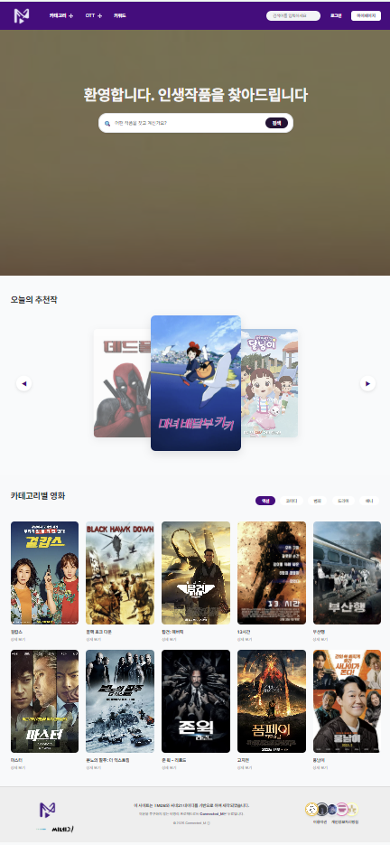
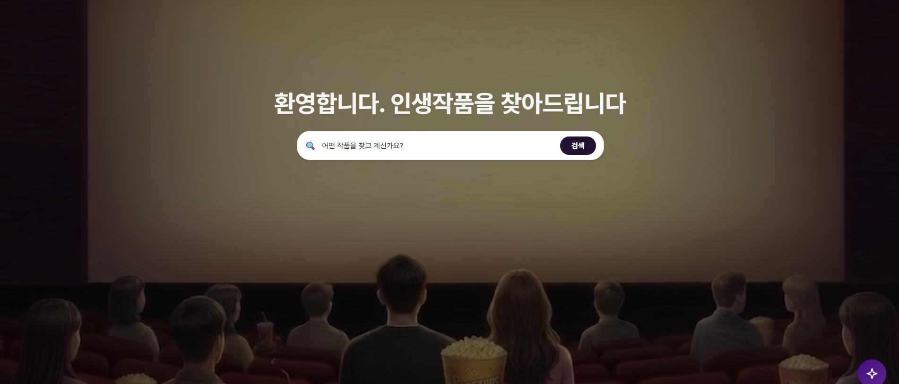
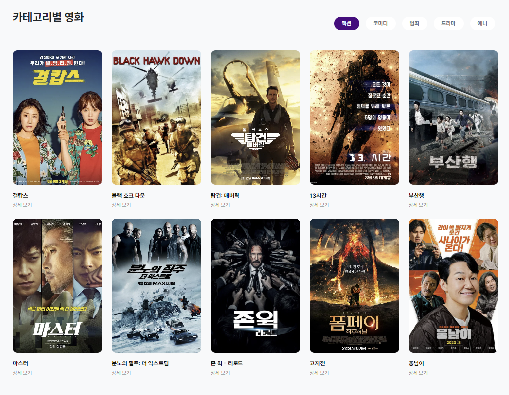
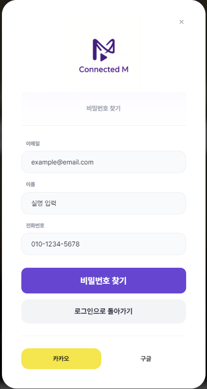
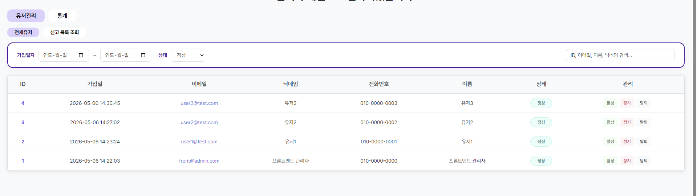
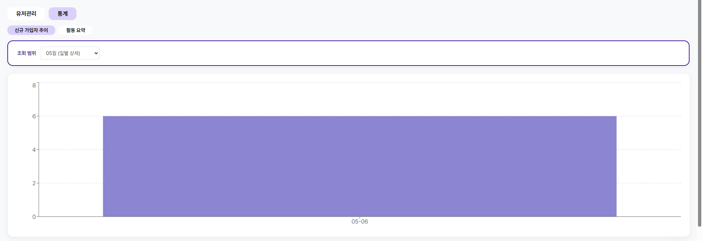
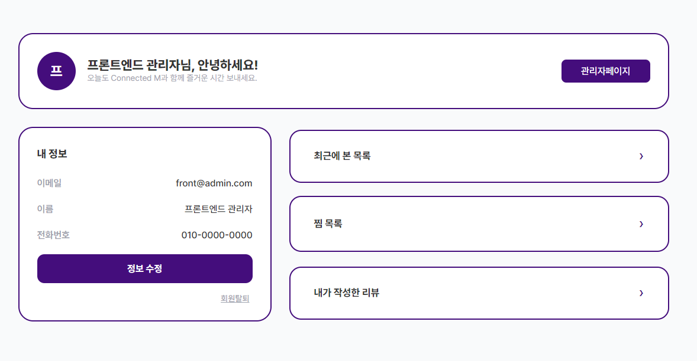
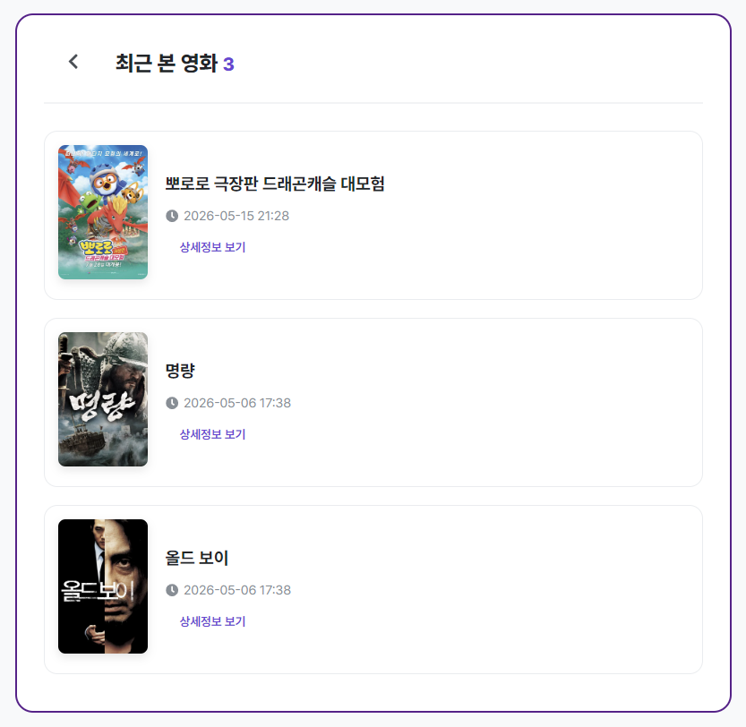

# 🎬 Connected_M — 영화 탐색 & AI 추천 플랫폼

> TMDB × 씨네21 데이터를 통합한 AI 기반 영화 탐색 플랫폼
> 개인 맞춤형 추천, 전문가 분석, 소셜 로그인을 한 곳에서 제공합니다.

<br>



---

## 📌 프로젝트 개요

| 항목 | 내용 |
|------|------|
| **프로젝트 유형** | 팀 프로젝트 (5인) |
| **목적** | 교육 및 포트폴리오 |
| **데이터 출처** | TMDB API, 씨네21 (크롤링) |
| **주요 특징** | AI 챗봇 추천, 소셜 로그인, 전문가 분석 통합 |

<br>

---

## 🧩 핵심 기능

### 🔍 영화 탐색 & 상세 정보
- TMDB 대중 데이터 + 씨네21 전문 분석 **이중 데이터 통합**
- 줄거리, 출연진/제작진, 장르, 전문가 코멘트 제공
- 주간 랭킹 & 트렌드 키워드 기반 영화 발견
- 제목 / 키워드 통합 검색






---

### 🤖 AI 기반 기능
- **AI 챗봇**: LangChain + Google Gemini API를 활용한 영화 문의 및 맞춤 추천
- **콘텐츠 분석**: 씨네21 리뷰 Embedding 기반 유사 영화 분석
- **FastAPI 서버**: Java 백엔드와 독립적으로 운영되는 Python AI 서버

---

### 👤 사용자 경험
- **스마트 인증**: 카카오 / 구글 OAuth2 소셜 로그인 + 이메일 JWT 인증
- **개인화 마이페이지**: 찜 목록, 작성 댓글, 시청 기록 관리
- **비밀번호 재설정**: 이메일 인증 방식




---

### 🛡️ 관리자 기능
- 사용자 활동 통계 대시보드 (Recharts 시각화)
- 활동 요약, 최근 기록, 찜 목록, 댓글 현황 관리





---

### 📄 마이페이지 & 상세 페이지





---

## 🛠 기술 스택

### Backend
| 분류 | 기술 |
|------|------|
| **메인 서버** | Java 17, Spring Boot 3.2.4 |
| **보안 / 인증** | Spring Security, OAuth2 (Kakao/Google), JWT |
| **데이터베이스** | MariaDB (JPA / Hibernate) |
| **API 문서화** | Swagger UI (SpringDoc 2.3.0) |
| **AI 프레임워크** | LangChain, Google Gemini API |
| **AI API 서버** | FastAPI (Python) |
| **데이터 수집** | Selenium, BeautifulSoup4, Sentence Transformers |

### Frontend
| 분류 | 기술 |
|------|------|
| **코어** | React 18, TypeScript, Vite |
| **라우팅** | React Router DOM v7 |
| **스타일링** | Vanilla CSS (모듈형 설계) |
| **데이터 시각화** | Recharts |
| **HTTP 클라이언트** | Axios |

---

## 📂 프로젝트 구조

### Backend
```
backend/
├── src/main/java/com/Connectedm/backend/
│   ├── config/       # 보안, OAuth2, JWT, Swagger 설정
│   ├── domain/       # 도메인별 엔티티, 리포지토리, 서비스, 컨트롤러
│   ├── global/       # 공통 예외 처리, 응답 포맷, 유틸리티
│   └── infra/        # 외부 API 연동 및 인프라 설정
├── ChatBot/          # FastAPI 기반 AI 챗봇 (LangChain + Gemini)
└── data_crawling/    # 데이터 수집 및 전처리 (Selenium + Embedding)
```

### Frontend
```
frontend/
└── src/
    ├── api/          # TMDB 및 백엔드 통신 로직
    ├── components/   # UI 컴포넌트 (Chatbot, Layout, Common)
    ├── hooks/        # 커스텀 훅 (인증 등)
    ├── pages/        # 페이지 컴포넌트 (Home, MovieDetail, Admin 등)
    └── types/        # TypeScript 타입 정의
```

---

## ⚙️ 로컬 실행 방법

### 사전 요구 사항
- JDK 17
- Node.js v18+
- MariaDB
- Python 3.x

### 1. 백엔드 (Java)
```bash
cd backend
# application.properties 환경변수 설정 후
./gradlew bootRun
```

### 2. AI 챗봇 서버 (Python)
```bash
cd backend/ChatBot
pip install -r requirements.txt
uvicorn main:app --reload --port 8000
```

### 3. 프론트엔드 (React)
```bash
cd frontend
npm install
npm run dev
```

---

## 👥 팀 구성

| 이름 | 역할 |
|------|------|
| 이명준 | 총괄 |
| 이건용 | 백엔드, 프론트엔드 |
| 이승우 | 데이터 크롤링 |
| 조우진 | UI 구현, 프론트엔드 |
| 한규대 | 데이터베이스 |

---

## 🗺️ 향후 개선 사항

- [ ] 관리자 페이지 신고 목록 기능 추가

---

## 📝 라이선스

본 프로젝트는 **교육 및 포트폴리오 목적**으로 제작되었습니다.
영화 데이터는 [TMDB](https://www.themoviedb.org/) 및 [씨네21](http://www.cine21.com/)에서 제공받았습니다.
