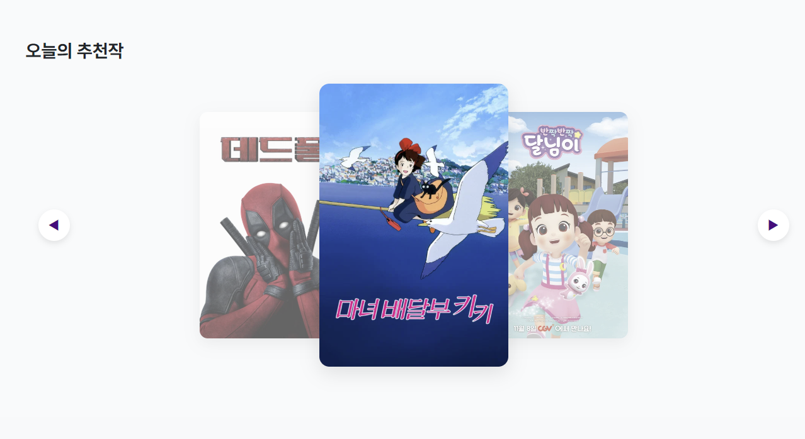
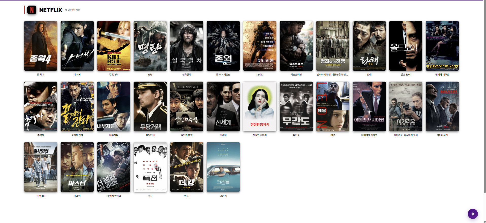
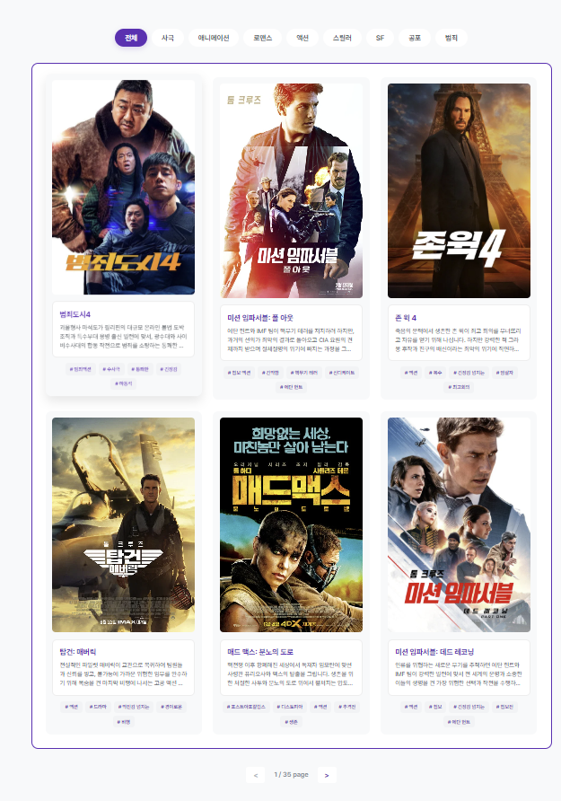
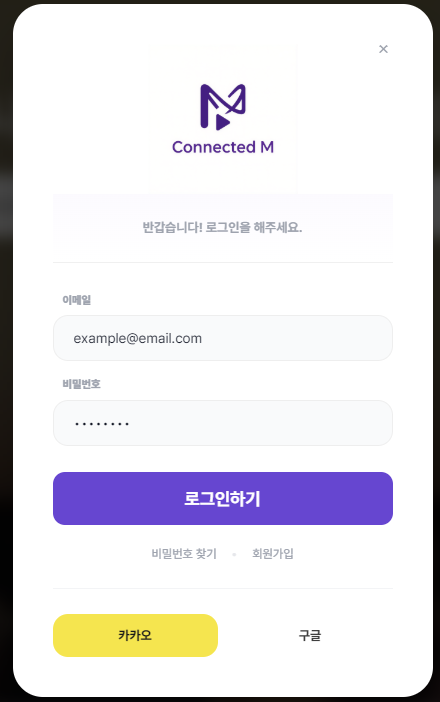
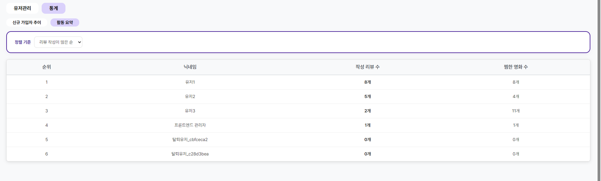
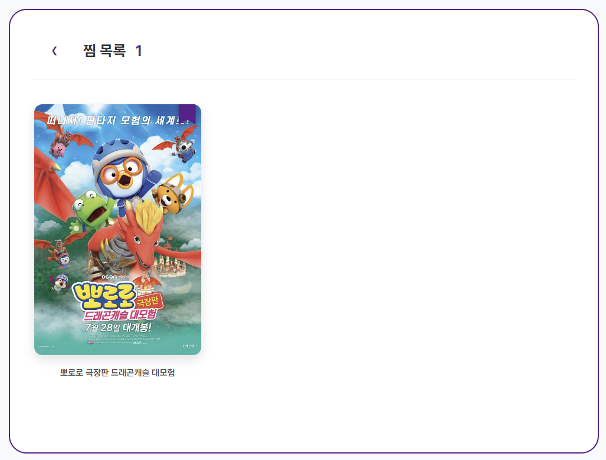
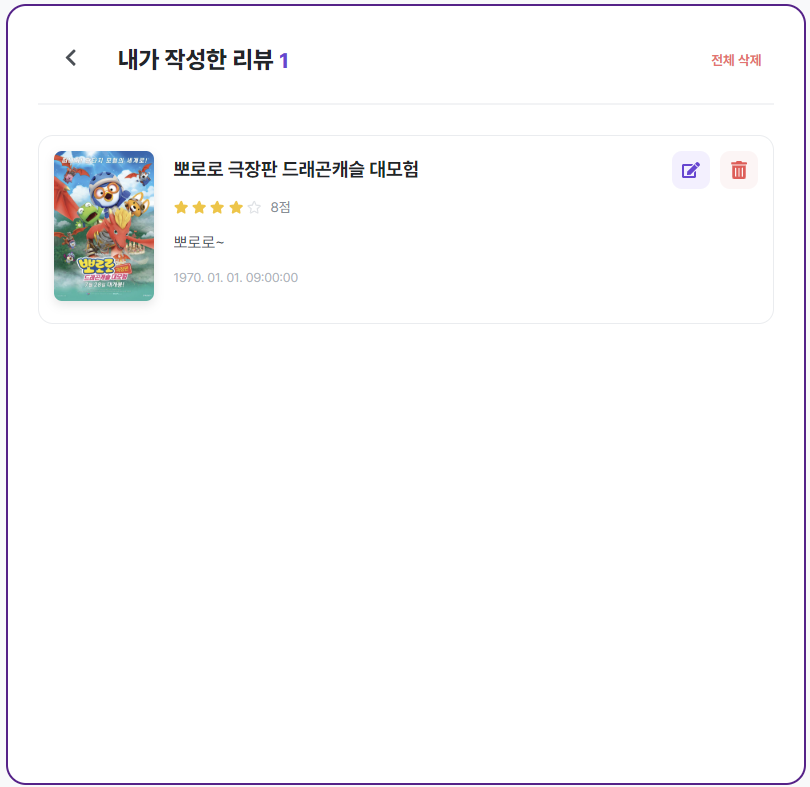
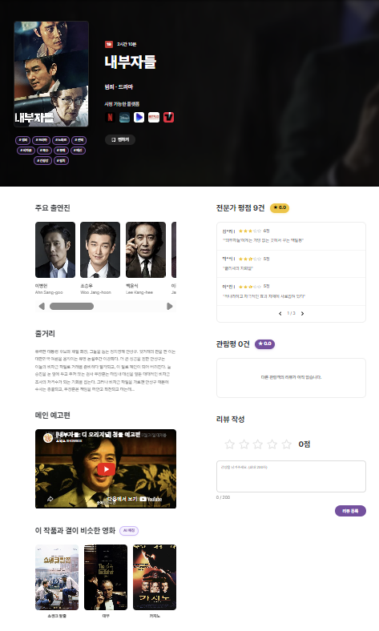

# Connected_M Frontend

Connected_M의 프론트엔드는 React와 TypeScript를 사용하여 구축된 현대적인 웹 애플리케이션입니다. Vite를 빌드 도구로 사용하여 빠른 개발 경험을 제공합니다.

## 🏗 프로젝트 구조

```text
frontend/
├── src/
│   ├── api/        # TMDB 및 백엔드 서버 통신 로직
│   ├── assets/     # 이미지, 아이콘 등 정적 자원
│   ├── components/ # 재사용 가능한 UI 컴포넌트
│   │   ├── chatbot/ # AI 챗봇 인터페이스
│   │   ├── common/  # 공통 컴포넌트 (모달 등)
│   │   └── layout/  # 레이아웃 컴포넌트 (Header, Footer)
│   ├── hooks/      # 커스텀 훅 (인증, 상태 관리 등)
│   ├── pages/      # 각 라우트별 페이지 컴포넌트
│   ├── types/      # TypeScript 타입 정의
│   └── utils/      # 공통 유틸리티 함수
├── public/         # 정적 파일
└── index.html      # 진입 HTML 파일
```

## 🛠 기술 스택
- **Core:** React 18, TypeScript
- **Build Tool:** Vite
- **Routing:** React Router DOM (v7)
- **State Management:** React Hooks
- **Styling:** Vanilla CSS (모듈형 설계)
- **Icons:** React Icons
- **Charts:** Recharts (데이터 시각화)
- **HTTP Client:** Axios

## ⚙️ 시작하기

### 1. 의존성 설치
`frontend/` 폴더에서 다음 명령어를 실행합니다:
```bash
npm install
```

### 2. 개발 서버 실행
```bash
npm run dev
```

### 3. 빌드
```bash
npm run build
```

## 🎨 주요 화면
- **홈:** 영화 트렌드 및 추천 목록
- **영화 상세:** 줄거리, 전문가 분석, 관련 데이터 시각화
- **검색 결과:** 키워드 및 제목 기반 검색
- **마이페이지:** 사용자 프로필 및 개인 설정
- **관리자 페이지:** 데이터 관리 및 통계















## 추후 학습을 통해 수정할 사항
- 관리자 페이지에서 신고목록 뜨게 만들기