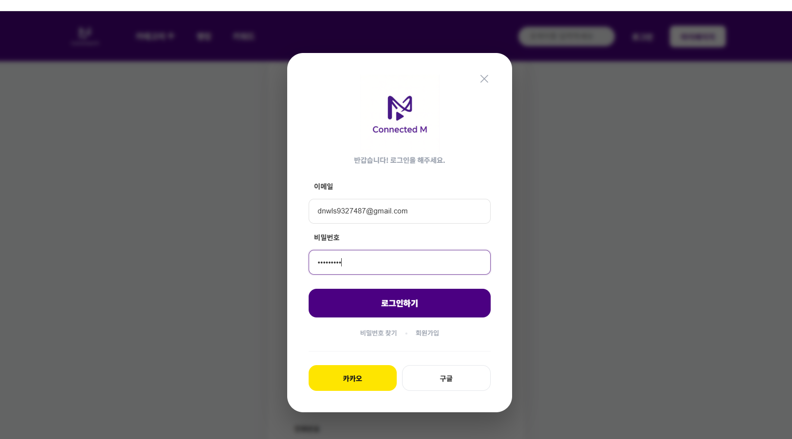

# 발표 첫시간 최종정리 
10:00 첫발표
~ 점심후까지 피드백하고 
다시 2차발표 
피드백상황 및 질의응답 사항을 반영했는지.... 


#  피드백 상황 및 질의응답 사항들을 잘 반영하엿고 수정하고 반려했는가 ++나중에 면접대비(?)발표태도 손짓, 몸짓, 말투,어조 등 연습하자는의도

어떤질문들이올까.........
어떤피드백이 올까...

	Q. 로그인후성공화면은 어떻게되어있을예정인가여 


	Q.  마이페이지, 랭킹, 키워드 페이지는 ? 
  


- 
2차발표시작하겠습니다.
지난발표떄의 여러가지 피드백 및 질문사항들을 수용하여서 정리해보았습니다.
피드백이후발표로써 저희팀이름,주제등의 기본소개는 생략 바로피드백수용및 보완점개선사항에대해 이야기하겠습니다.

 Connected_M 

저희 프로젝트핵심인 
제미나이AI,키워드픽은 사용자의 인터페이스기본원칙(ui설계원칙) 즉 사용자의 직관성을 고려하여 누구나쉽게 이해하고 사용할수있도록 편리함을 극대화시키고 이를 확장시키기 위함을 중점적으로 설계 및 구현하였으며  이 과정에서 사용자가 배포된기능을 사용했을떄 긍정적반응을 느낄수있게하는것이 목표입니다 . 이를 기반으로 앞서말씀하셨던 보완점 및 피드백을 적극수용하여 보완하였습니다.

- 흩어져 있는 다양한 OTT 영화들을 한 곳에서 통합 검색할 수 있는 편리함을 제공
- GEMINI AI API를 통해 요약하여 사용자에게 제공하는 것이 핵심


지난발표떄의 ~~~~~라는 피드백을 반영하여 ~~~~~부분을 수정하였습니다(?) 수정할것입니다(?) 
또한 ~~~라는 문제가있어서  추후 팀 회의를하며 검토할예정입니다.

~~는 ~~~~~~~~~해서 이대로할생각입니다. 구현단계에서는가능하지만 ~~~~합니다.

또 ~~~~~~~~피드백은 사용자의입장에서 직관성을고려하여 


또 #슬픈영화  #무서운영화 #우울할때보기좋은영화 등을 키워드픽 , 해시태그 형식으로넣어서 


~~~~~~


감사합니다.


- 
```JSX
1.리뷰 분석 (The Expert Critic): "수만 개의 시장 리뷰를 사용자가 다 읽을 순 없죠. 저희 AI 비서는 그 리뷰들을 대신 읽고 '이 영화는 재밌지만 마무리가 약간 아쉬움'이라고 딱 한 줄로 요약해 주는 전문 비평가입니다.
"스마트 비서 (The Concierge): "단순히 영화만 고르는 게 아니라, '오늘 좀 로맨스영화가 댕기는데?'라고 말하면 딱 맞는 영화을 추천해 주는 친절한 점장님과 대화하는 경험을 제공합니다."
2.구분기존 방식 (일반 검색)Connected_M 
리뷰 확인수백개의 리뷰를 (Gemini 기반) 요약. 이를통해  스크롤긍정/부정 비율 & 핵심 키워드 즉시 요약추천 방식장르/연도 등 딱딱한 "비 오는 날 혼자 보기 좋은 영화" 같은 감성 대화데이터 처리단순 텍스트 나열TMDB 데이터 + 크롤링 리뷰의 유의미한 분석
```


--입니다. --를 구현했습니다 표현지향 


피드백. 보완점


-------------


 

 
1.	전문가리뷰를 이미크롤링해서 컨텐츠리뷰 ERD에 다 저장되어있는지?


-	수집한리뷰 ERD를 보면 엔티티명이 전문가리뷰(Expert review)이며 각각의 컬럼을보면 콘텐츠아이디,분석아이디등 컬럼6개를크롤링하는식으로 db를구축해놓았습니다.


2.	Tmdb 앞으로나올것들은 어떤프로세스루 데이터들이쌓이게되는지?


  Ex) 새로운영화가 개봉 및 업데이트되면 콘텐츠 엔티티에 영화 데이터가 저장될것이고 Expert리뷰엔티티도 당연히 크롤링할것이다. 그러면 자동적으로 AI분석캐시에의해서 로우데이터의값 요약,긍정비율 등을 AI가 생성한다. 즉  
- 스프링부트 서비스 내부로직이 이 데이터가 자동으로 생성되게한다.

3.	 평점찾느게 없다면  어떻게할건지? (넷플에서는 크롤링하지않음)

TMDB기반으로 크롤링을 하지만 이에대비하여 씨네21에서도 함께크롤링한다.
또 크롤링파트에서 다양한경로로 크롤링할 예정입니다.

데이터크롤링하는출처는 씨네21, tmdb임 tmdb에는 간혹 전문가리뷰가없는경우가잇다.
-	수집하는크롤링하는 데이터 리뷰,콘텐츠 (엔티티) 
-	내부 ai가 직접 수집한데이터를 참조해서 가공한2차데이터 
  


4.	사용자에게 관심사 자주보는카테고리 그것에따라 자동으로추천하는기능이잇는지?

 메인페이지에 오늘의추천작이 이에대한 기능입니다. 먼저 -최초엔  추천작을  평점높은순으로 5개 추출 하도록구현할것이며 이후에 사용자가 위시리스트나 찜으로 관심영화를 누르거나 등록하면 자동으로 오늘의추천작이 갱신되는 기능을구현할예정입니다. 즉 많은회원 회원들의 많은 데이터가 쌓이면 자동으로 영화를 추천하는기능이 생기게됩니다.
-	회원데이터가쌓이면구현가능


5.	 연동해줄수잇는 오티티목록


-	저희방향성은.. 보고싶은영화를누르면 어디서볼수있는지 그런 ott정보를 확인가능하도록 사용자에게보여주기위함이 방향성입니다. 즉 검색된 콘텐츠가 어디 플랫폼에서이용가능한지 정보를 출력하도록 구현할예정입니다.
-	Erd 


-	Ex) 유튜브알ㄹ고리즘
축구 야구 검색하면 이 두글자만 검색햇지만 연관동영상에 다양한 축구야구 영상이뜨도록 


6.	---- 7.8.9.

------------
6.	오티티내부에 자체적리뷰시스템이없다면 어떻게구현할지?
-EX) tmdb api에 없는 리뷰가 없는 것이 몇몇있다. 이에 씨네21. TMDB. – TMDB에없는 것도 다양한경로에서 데이터를가져온다 그래서 
이를방지하기위한 tmdb 전문가리뷰가없는영화 그리고 이영화리뷰가 있는다른 .. 씨네21
에서 데이터크롤링을해온다. 약 15개정도의 데이터를크롤링해왔습니다. 이렇게해서 다양한경로에서가져옴으로써 부족한것을  보완합니다.


7.	계약기간만료(종료)리뷰 사이에 만료되는건 어떻게관리?
Ai 가 매일 크롤링되니까 
가져오는 api는 남아잇으니까 크게문제도될건없다


ai분석캐시 엔티티가 중요
에이아이가져온데이터를 파이썬에서가공 스프링부트에서 다시 로직에맞게 가공 그리고 디비에저장  
-강사님 답변
외부데이터연동으로처리
-	씨네21. TMDB. – TMDB에없는 것도 다양한경로에서 데이터를가져온다


***저희프로젝트는 리뷰를남기고공유하는서비스이고 영상을구매하는것아님.
트레일러(예고편)이 나오긴한다.
동영상직접적제공x 우린 무료 직접적인동영상제공 서비스,,, x
-	영화,ott 동영상등 구매 즉, 상업적 용도가아님***


8.	마이페이지에는?? 

카드형식으로 찜,리뷰,리스트 등을추후에 구현할예정. 
무엇이잇나   - 


이를토대로 준비해나가겠습니다.


-성능최적화-
데이터베이스 ERD를 보시면 'AI분석캐시(AnalysisCache)' 테이블이 존재합니다. 
이미존재하는데이터를크롤링하여 받아온데이터를  AI가 요약한 텍스트, 긍정 비율, 키워드 등은 이 캐시 테이블에 저장해두고, 
다음 요청 시 API를 재호출하지 않고 DB에서 바로 불러오도록 설계하여 속도와 비용 문제를 해결했습니다.


---
서비스이해도.
크롤링 디비저장 뭐를할지......

대기업 

권한,,,
//
팀프로젝트명정도는알아야지 하;'
//
협업 

소통 프로젝트이해도. 

로그인로그아웃구현 각각의파트 
디스코드는넘어가 위로 
업무배분명확히

PT 방식차이 이해도
ㅈㅅㅈㅅ

PT
자세

요청.. 넘겨주세요..
보고읽기...NO

radius

씨네21 게시판리뷰 차이
파이어 도입?