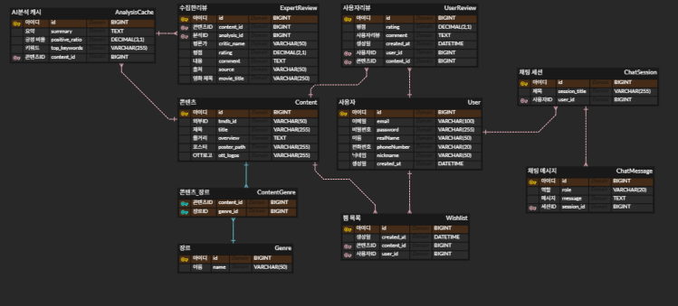

# Backend 설계 브리핑 (1)
<p align="center">
  
  
  
  
  
</p>


## ERD 설계 
- ERD(Entity Relationship Diagram) : 개체 - 관계 모델의 약자로, **DB를 구축하기 전에 데이터들 간의 관계를 그림으로 나타낸 설계도**

## 식별(Identifying), 비식별(Non-Identifying)
부모의 PK를 내 PK로 쓰느냐(실선 => 식별), 단순참조용 FK로만 쓰느냐(점선 => 비식별)의 차이. 현대적 설계에서는 독립성을 위해 **비식별 관계(점선)**를 지향한다. 

- 그렇지만 식별관계를 꼭 써야 하는 경우 : 테이블의 존재 이유가 부모일 경우. 즉 부모테이블에 종속될 수 밖에 없는 테이블인 경우 식별관계(실선)로 설정해야한다. 종속된 테이블은 부모 테이블들의 id를 자기의 PK(이름표)로 쓰므로 중복되는 데이터가 들어오는 것을 방지할 수 있다. 또한 부모의 PK를 품고 있기 때문에 SELECT실행 시 부모 테이블의 데이터 까지 가지 않고 찾을 수 있어 쿼리성능(조인 최소화) 최적화에 유리하다.
- 우리의 ERD 설계에선 콘텐츠와 장르의 관계들만 식별관계이고 나머지 테이블들의 관계는 비식별관계.

### 설계 변경 점


1. 초기 설계에서 언급된 최소한의 구현을 위한 Entity
    - 콘텐츠-장르 도메인 분리: 장르 데이터를 Content 테이블 내 텍스트로 저장하지 않고, Genre와 ContentGenre로 정규화하여 데이터 중복을 제거함.
    - 성능 최적화 (서버 부하 감소): 장르별 검색 시 대량의 텍스트를 전수 조사(Full Scan)하는 대신, 인덱싱된 중간 테이블(ContentGenre)을 참조하게 하여 검색 속도 향상 및 시스템 부하 최소화.
    - 다대다(N:M) 관계 해소: Content와 Genre 사이의 복잡한 관계를 1:N, N:1로 구조화하여 데이터 무결성을 확보하고, 향후 장르 추가나 메타데이터 확장이 용이한 구조 구축.  


2. AI를 활용한 데이터 크롤링과 분석을 위한 AI분석캐시 테이블 추가


3. AI가 수집해온 콘텐츠별 전문가 리뷰 테이블 추가

## API 명세서 (Interface Specification)

### 1. 인증 및 회원 관리 (Auth & Members)
| 분류 | 기능 | Method | Endpoint | 파라미터 / 비고 |
| :--- | :--- | :---: | :--- | :--- |
| **인증** | 신규 회원가입 | `POST` | `/api/auth/signup` | `email`, `password`, `nick` / Spring Security 적용 |
| **인증** | 로그인 및 토큰 발급 | `POST` | `/api/auth/login` | `email`, `password` / JWT 발급 |
| **멤버** | 찜한 영화 목록 조회 | `GET` | `/api/members/wishlist` | Access Token 필요 |
| **멤버** | 위시리스트 추가/삭제 | `POST` | `/api/members/wishlist` | `tmdbId` (Body) / 토글 방식 권장 |

### 2. 콘텐츠 탐색 (Contents)
| 분류 | 기능 | Method | Endpoint | 설명 / 비고 |
| :--- | :--- | :---: | :--- | :--- |
| **메인** | 메인 데이터 통합 조회 | `GET` | `/api/contents/main` | 배경용 랜덤 영화, 추천작, 장르별 리스트 포함 |
| **목록** | 콘텐츠 전체 목록 | `GET` | `/api/contents` | 전체 영화 페이징 조회 (기본 최신순) |
| **목록** | 장르별 목록 조회 | `GET` | `/api/contents/genre/{genreId}` | 특정 장르 필터링 조회 |
| **상세** | 콘텐츠 상세 정보 | `GET` | `/api/contents/{id}` | 본체 + AI 요약(AnalysisCache) + 리뷰 통합 |
| **검색** | 콘텐츠 검색 | `GET` | `/api/contents/search` | 제목 키워드(`keyword`) 기반 검색 |
| **검색** | 검색어 자동 완성 | `GET` | `/api/contents/search/hints` | 입력 중인 단어 기반 제목 리스트 반환 |

### 3. 리뷰 및 관리 (Reviews & Admin)
| 분류 | 기능 | Method | Endpoint | 설명 / 비고 |
| :--- | :--- | :---: | :--- | :--- |
| **리뷰** | 유저 리뷰 등록 | `POST` | `/api/contents/user-reviews` | 평점(`rating`) 및 한줄평(`comment`) 저장 |
| **리뷰** | 유저 리뷰 수정 | `PUT` | `/api/contents/user-reviews/{id}` | 작성한 본인만 수정 가능 |
| **리뷰** | 유저 리뷰 삭제 | `DELETE` | `/api/contents/user-reviews/{id}` | 리뷰 삭제 기능 |
| **관리** | 전문가 리뷰 적재 | `POST` | `/api/contents/expert-reviews` | 크롤러용 AI 분석 결과 및 전문가 평 적재 |

## API 구현 현황 (Status Report)

> **기준일**: 2026-04-02  
> **현재 상태**: 핵심 도메인(콘텐츠, AI 분석, 전문가 리뷰) API 구현 완료 및 프론트 연동 테스트 중

---

###  1. 구현 완료 (Completed)
*백엔드 로직 작성이 완료되어 즉시 호출 및 시연이 가능한 API입니다.*

| 분류 | 기능 | Method | Endpoint | 특이사항 |
| :--- | :--- | :---: | :--- | :--- |
| **콘텐츠** | 메인 통합 조회 | `GET` | `/api/contents/main` | 추천작 + 장르별 리스트 반환 |
| **콘텐츠** | 상세 정보 조회 | `GET` | `/api/contents/{id}` | 본체 + AI 캐시 + 전문가 리뷰 통합 |
| **인증** | 회원가입 기초 | `POST` | `/api/auth/signup` | BCrypt 암호화 로직 적용 완료 |
| **리뷰** | 전문가 리뷰 적재 | `POST` | `/api/contents/expert-reviews` | AI 분석 및 평론가 데이터 관리용 |
| **장르** | 장르별 목록 조회 | `GET` | `/api/contents/genre/{id}` | N:M 해소 구조 기반 필터링 |

---

###  2. 구현 예정 (To-Do)
*발표 이후 2단계 고도화 과정에서 순차적으로  처리할 과업입니다.*

| 분류 | 기능 | Method | Endpoint | 우선순위 |
| :--- | :--- | :---: | :--- | :---: |
| **인증** | 로그인 및 토큰 발급 | `POST` | `/api/auth/login` | 🔥 상 (JWT 도입 예정) |
| **리뷰** | 유저 리뷰 등록/수정 | `POST/PUT` | `/api/contents/user-reviews` | 🔥 상 (작성 로직 연결) |
| **검색** | 콘텐츠 키워드 검색 | `GET` | `/api/contents/search` | ⚡ 중 (키워드 매칭) |
| **검색** | 검색어 자동 완성 | `GET` | `/api/contents/search/hints` | ⚡ 중 (Title 기반) |
| **멤버** | 위시리스트 토글 | `POST` | `/api/members/wishlist` | ⚡ 중 (찜하기 기능) |
| **리뷰** | 유저 리뷰 삭제 | `DELETE` | `/api/contents/user-reviews/{id}` | ☁️ 하 (본인 확인 로직) |

---

### 코멘트
- **Security 상태**: 현재 `/api/contents/**` 경로는 화이트리스트(`permitAll`)로 설정되어 있어 로그인 기능 구현 전에도 프론트엔드에서 자유롭게 데이터 호출이 가능합니다.
- **데이터 흐름**: 전문가 리뷰 적재 시 `AnalysisCache`가 동시에 갱신되도록 설계되어 상세 페이지 응답 속도가 최적화되어 있습니다.

## CONNECTED_M 프로젝트(SpringBoot)

### 프로젝트 설정
- SDK: Amazon Corretto 17.0.17
- Language Level: SDK Default (Java 17)
- Build Tool: Gradle 
- Database: MariaDB 11.x (Port: 3310)

### 디렉토리 트리
com.Connectedm.backend
├── 📂 config           👉 SecurityConfig.java, WebConfig.java (보안 및 CORS)
├── 📦 domain (핵심 비즈니스 로직)
│    ├── 📂 ai          👉 (작업 예정) Python AI 서버 WebClient 통신 로직
│    ├── 📂 auth
│    ├── 📂 content (콘텐츠 도메인)
│    │    ├── 📂 controller  👉 ContentController.java
│    │    ├── 📂 dto         👉 ContentResponse.java
│    │    ├── 📂 entity      👉 Content.java
│    │    ├── 📂 repository  👉 ContentRepository.java
│    │    └── 📂 service     👉 ContentService.java
│    │
│    └── 📂 user (회원 도메인)
│         ├── 📂 controller  👉 UserController.java
│         ├── 📂 dto         👉 UserResponse.java, UserSignupRequest.java
│         ├── 📂 entity      👉 User.java
│         ├── 📂 repository  👉 UserRepository.java
│         └── 📂 service     👉 UserService.java
│
├── 📦 global (공통 설정 및 예외 처리)
│    ├── 📂 auth             👉 JwtTokenProvider.java (JWT 인증 관리)
│    ├── 📂 common           👉 ApiResponse.java (프론트엔드 공통 응답 폼)    
│    └── 📂 error            👉 CustomException.java, ErrorCode.java, GlobalExceptionHandler.java
│
└── 📦 infra (외부 서버 연동)

### Dependecies
```java
dependencies {
	implementation 'org.springframework.boot:spring-boot-starter-data-jpa'
	implementation 'org.springframework.boot:spring-boot-starter-security'
	implementation 'org.springframework.boot:spring-boot-starter-web'
	implementation 'org.springframework.boot:spring-boot-starter-webflux'
	compileOnly 'org.projectlombok:lombok'
	runtimeOnly 'org.mariadb.jdbc:mariadb-java-client'
	annotationProcessor 'org.projectlombok:lombok'
	testImplementation 'org.springframework.boot:spring-boot-starter-test'
	testImplementation 'io.projectreactor:reactor-test'
	testImplementation 'org.springframework.security:spring-security-test'
	testRuntimeOnly 'org.junit.platform:junit-platform-launcher'

}
```

### properties 설정
```java
spring.application.name=backend
spring.datasource.url=jdbc:mariadb://localhost:3310/connected_m
spring.datasource.username=root
spring.datasource.password=1234
spring.datasource.driver-class-name=org.mariadb.jdbc.Driver
spring.jpa.generate-ddl=true
spring.jpa.database-platform=org.hibernate.dialect.MariaDBDialect
spring.jpa.hibernate.ddl-auto=update
spring.jpa.show-sql=true


springdoc.swagger-ui.path=/swagger-ui.html
springdoc.api-docs.path=/api-docs
springdoc.show-data-rest=true
```
### user패키지
1. entity & repository
```java
// UserEntity 
package com.Connectedm.backend.domain.user.entity;

import com.Connectedm.backend.domain.content.entity.UserReview;
import jakarta.persistence.*;
import lombok.*;
import org.hibernate.annotations.CreationTimestamp;

import java.time.LocalDateTime;
import java.util.ArrayList;
import java.util.List;

@Entity
@Table(name = "user")
@Getter
@NoArgsConstructor(access = AccessLevel.PROTECTED)
@AllArgsConstructor
@Builder
public class User {
    @Id
    @GeneratedValue(strategy = GenerationType.IDENTITY)
    private Long id;

    @Column(nullable = false, unique = true, length = 100)
    private String email;

    @Column(nullable = false, length = 255)
    private String password;

    // 이름 추가
    @Column(nullable = false, length = 50)
    private String realName;

    // 전화번호 추가
    @Column(length = 20)
    private String phoneNumber;

    @Column(nullable = false, length = 50)
    private String nickname;

    @CreationTimestamp
    @Column(name="created_at", nullable = false, updatable = false)
    private LocalDateTime createdAt;

    // UserReview와 관계 연결
    @OneToMany(mappedBy = "user", cascade = CascadeType.ALL, orphanRemoval = true)
    private List<UserReview> reviews = new ArrayList<>();

    // DB 저장되기 직전에 번호 형식 바꿔주는 로직
    @PrePersist
    @PreUpdate
    public void formatPhoneNumber() {
        if (this.phoneNumber != null) {
            // 숫자만 남기기
            String digits = this.phoneNumber.replaceAll("[^0-9]", "");

            // 10~11자리 숫자에 대해 하이픈 적용
            if (digits.length() == 11) {
                this.phoneNumber = digits.replaceFirst("(\\d{3})(\\d{4})(\\d{4})", "$1-$2-$3");
            } else if (digits.length() == 10) {
                this.phoneNumber = digits.replaceFirst("(\\d{3})(\\d{3})(\\d{4})", "$1-$2-$3");
            }
        }
    }
}


```
```java
// UserRepository
package com.Connectedm.backend.domain.user.repository;

import com.Connectedm.backend.domain.user.entity.User;
import org.springframework.data.jpa.repository.JpaRepository;
import org.springframework.stereotype.Repository;

import java.util.Optional;

@Repository
public interface UserRepository extends JpaRepository<User, Long> {

    // 로그인 시 이메일로 사용자를 찾기 위한 메서드
    Optional<User> findByEmail(String email);

    // 중복 가입 방지 체크
    boolean existsByEmail(String email);

    // 닉네임 중복 체크도 필요
    boolean existsByNickname(String nickname);
}

```
2. DTO
    1. UserLoginRequest
    ```java
    package com.Connectedm.backend.domain.user.dto;

    import lombok.AllArgsConstructor;
    import lombok.Builder;
    import lombok.Getter;
    import lombok.NoArgsConstructor;

    @Getter
    @NoArgsConstructor
    @AllArgsConstructor
    @Builder
    public class UserLoginRequest {
        private String email;
        private String password;
    }

    ```
    2. UserSignupRequest
    ```java
    package com.Connectedm.backend.domain.user.dto;

    import lombok.AllArgsConstructor;
    import lombok.Builder;
    import lombok.Getter;
    import lombok.NoArgsConstructor;

    @Getter
    @NoArgsConstructor
    @AllArgsConstructor
    @Builder
    public class UserSignupRequest {
        private String email;
        private String password;
        private String nickname;
        private String realName;
        private String phoneNumber;
    }
    ```
    3. UserResponse
    요구사항이 복잡해질 경우 UserSummaryResponse, UserDetailResponse 식으로 추가.
    ```java
    package com.Connectedm.backend.domain.user.dto;

    import com.Connectedm.backend.domain.user.entity.User;
    import lombok.AllArgsConstructor;
    import lombok.Builder;
    import lombok.Getter;
    import lombok.NoArgsConstructor;

    @Getter
    @NoArgsConstructor
    @AllArgsConstructor
    @Builder
    public class UserResponse {
        private Long id;
        private String email;
        private String nickname;
        private String realName;
        private String phoneNumber;

        public static UserResponse from(User user) {
            return UserResponse.builder()
                    .id(user.getId())
                    .email(user.getEmail())
                    .nickname(user.getNickname())
                    .realName(user.getRealName())
                    .phoneNumber(user.getPhoneNumber())
                    .build();
        }
    }
    ```
3. service
```java
package com.Connectedm.backend.domain.user.service;

import com.Connectedm.backend.domain.user.dto.UserLoginRequest;
import com.Connectedm.backend.domain.user.dto.UserResponse;
import com.Connectedm.backend.domain.user.dto.UserSignupRequest;
import com.Connectedm.backend.domain.user.entity.User;
import com.Connectedm.backend.domain.user.repository.UserRepository;
import com.Connectedm.backend.global.error.CustomException;
import com.Connectedm.backend.global.error.ErrorCode;
import lombok.RequiredArgsConstructor;
import org.springframework.security.crypto.bcrypt.BCryptPasswordEncoder;
import org.springframework.stereotype.Service;
import org.springframework.transaction.annotation.Transactional;

@Service
@RequiredArgsConstructor
@Transactional(readOnly = true)
public class UserService {
    private final UserRepository userRepository;
    private final BCryptPasswordEncoder passwordEncoder;

    @Transactional
    public Long signUp(UserSignupRequest request) {
        // 1. 이메일 중복 체크
        if (userRepository.existsByEmail(request.getEmail())) {
            throw new CustomException(ErrorCode.ALREADY_REGISTERED_EMAIL);
        }

        // 2. 닉네임 중복 체크
        if (userRepository.existsByNickname(request.getNickname())) {
            throw new CustomException(ErrorCode.ALREADY_USED_NICKNAME);
        }

        // 3. 암호화 및 빌더로 저장
        String encodedPassword = passwordEncoder.encode(request.getPassword());
        User user = User.builder()
                .email(request.getEmail())
                .password(encodedPassword)
                .nickname(request.getNickname())
                .realName(request.getRealName())
                .phoneNumber(request.getPhoneNumber())
                .build();

        return userRepository.save(user).getId();
    }

    public UserResponse login(UserLoginRequest request) {
        User user = userRepository.findByEmail(request.getEmail())
                .orElseThrow(() -> new CustomException(ErrorCode.USER_NOT_FOUND));

        if (!passwordEncoder.matches(request.getPassword(), user.getPassword())) {
            throw new CustomException(ErrorCode.INVALID_PASSWORD);
        }
        return UserResponse.from(user);
    }

    // 3. 마이페이지 유저 정보 조회
    public UserResponse getUserInfo(Long userId) {
        User user = userRepository.findById(userId)
                .orElseThrow(() -> new CustomException(ErrorCode.USER_NOT_FOUND));

        return UserResponse.from(user);
    }
}

```
UserService 작성 중 passwordEnconder와 errorcode 작성

- SecurityConfig
    원할한 프론트엔트 테스트를 위해 현재는 permitAll 설정
```java
package com.Connectedm.backend.config;

import org.springframework.context.annotation.Bean;
import org.springframework.context.annotation.Configuration;
import org.springframework.security.config.annotation.web.builders.HttpSecurity;
import org.springframework.security.config.annotation.web.configuration.EnableWebSecurity;
import org.springframework.security.config.annotation.web.configurers.AbstractHttpConfigurer;
import org.springframework.security.crypto.bcrypt.BCryptPasswordEncoder;
import org.springframework.security.web.SecurityFilterChain;
import org.springframework.web.cors.CorsConfiguration;
import org.springframework.web.cors.CorsConfigurationSource;
import org.springframework.web.cors.UrlBasedCorsConfigurationSource;

import java.util.List;

@Configuration
@EnableWebSecurity
public class SecurityConfig {

    // 1. 비밀번호 암호화 빈 등록
    @Bean
    public BCryptPasswordEncoder passwordEncoder() {
        return new BCryptPasswordEncoder();
    }

    // 2. HTTP 보안 및 필터 체인 설정
    @Bean
    public SecurityFilterChain filterChain(HttpSecurity http) throws Exception {
        http
                // CSRF 비활성화 (REST API 환경)
                .csrf(AbstractHttpConfigurer::disable)

                // ✨ CORS 설정을 보안 필터 체인에 직접 적용
                .cors(cors -> cors.configurationSource(corsConfigurationSource()))

                // 기본 로그인 폼 및 HTTP Basic 인증 비활성화
                .formLogin(AbstractHttpConfigurer::disable)
                .httpBasic(AbstractHttpConfigurer::disable)

                // 경로별 권한 설정
                // SecurityConfig.java의 filterChain 메서드 안에서
                .authorizeHttpRequests(auth -> auth
                        // ✨ OPTIONS 요청(Preflight)을 무조건 허용하도록 맨 위에 추가
                        .requestMatchers(org.springframework.web.cors.CorsUtils::isPreFlightRequest).permitAll()
                        .requestMatchers("/api/auth/**").permitAll()
                        .requestMatchers("/register").permitAll()
                        .requestMatchers("/api/contents/**").permitAll()
                        .requestMatchers("/swagger-ui/**", "/v3/api-docs/**").permitAll()
                        .anyRequest().authenticated()
                );

        return http.build();
    }

    // 3. ✨ WebConfig의 기능을 흡수한 통합 CORS 설정
    @Bean
    public CorsConfigurationSource corsConfigurationSource() {
        CorsConfiguration config = new CorsConfiguration();

        // 허용할 프론트엔드 주소 (React 기본 포트 3000, Vite 5173 모두 포함)
        config.setAllowedOrigins(List.of("http://localhost:3000", "http://localhost:5173"));
        // 허용할 HTTP 메서드
        config.setAllowedMethods(List.of("GET", "POST", "PUT", "DELETE", "OPTIONS"));
        // 허용할 헤더
        config.setAllowedHeaders(List.of("*"));
        // 쿠키 및 인증 정보(Credentials) 허용
        config.setAllowCredentials(true);
        // 응답 헤더 노출 설정
        config.setExposedHeaders(List.of("*"));

        UrlBasedCorsConfigurationSource source = new UrlBasedCorsConfigurationSource();
        // 모든 경로(/**)에 대해 위 설정을 적용
        source.registerCorsConfiguration("/**", config);
        return source;
    }
}
```
- Error
```java
// customexception
package com.Connectedm.backend.global.error;

import lombok.Getter;

@Getter
public class CustomException extends RuntimeException {
    private final ErrorCode errorCode;

    public CustomException(ErrorCode errorCode) {
        super(errorCode.getMessage());
        this.errorCode=errorCode;
    }
}

```
```java
//errorcode
package com.Connectedm.backend.global.error;

import lombok.Getter;
import lombok.RequiredArgsConstructor;
import org.springframework.http.HttpStatus;

@Getter
@RequiredArgsConstructor
public enum ErrorCode {

    // User 관련 에러(400번대)
    ALREADY_REGISTERED_EMAIL(HttpStatus.BAD_REQUEST, "U001", "이미 가입된 이메일입니다! "),
    ALREADY_USED_NICKNAME(HttpStatus.BAD_REQUEST, "U002", "이미 사용 중인 닉네임이에요!"),
    USER_NOT_FOUND(HttpStatus.NOT_FOUND, "U003", "해당 사용자를 찾을 수 없습니다! "),
    INVALID_PASSWORD(HttpStatus.UNAUTHORIZED, "U004", "비밀번호가 일치하지 않습니다!"),

    // --- 공통 에러 ---
    INTERNAL_SERVER_ERROR(HttpStatus.INTERNAL_SERVER_ERROR, "C001", "서버에 문제가 생겼어요! ");

    private final HttpStatus httpStatus;
    private final String code;
    private final String message;

}
```
ErrorCode -> Enum 활용: 정해진 규격(UserRole, ErrorCode)을 통한 데이터 정합성 확보, UserRole은 아직 미구현

4. user.controller
프론트엔드와 마주하는 곳. 미리 약속한 API 명세서에 맞게 설정
```java
package com.Connectedm.backend.domain.user.controller;

import com.Connectedm.backend.domain.user.dto.UserLoginRequest;
import com.Connectedm.backend.domain.user.dto.UserResponse;
import com.Connectedm.backend.domain.user.dto.UserSignupRequest;
import com.Connectedm.backend.domain.user.service.UserService;
import com.Connectedm.backend.global.common.ApiResponse;
import lombok.RequiredArgsConstructor;
import org.springframework.web.bind.annotation.*;

@RestController
@RequestMapping("/api/auth")
@RequiredArgsConstructor
public class UserController {

    private final UserService userService;

    // 1. 신규 회원가입
    @PostMapping("/signup")
    public ApiResponse<Long> signUp(@RequestBody UserSignupRequest request) {
        Long userId = userService.signUp(request);
        return ApiResponse.success(userId);
    }

    // 2. 로그인 및 JWT 발급 준비
    @PostMapping("/login")
    public ApiResponse<UserResponse> login(@RequestBody UserLoginRequest request) {
        UserResponse response = userService.login(request);
        return ApiResponse.success(response);
    }

    // 3. 마이페이지 정보 조회 API
    @GetMapping("/{userId}")
    public ApiResponse<UserResponse> getMyPage(@PathVariable Long userId) {
        UserResponse response = userService.getUserInfo(userId);
        return ApiResponse.success(response);
    }
}
```
