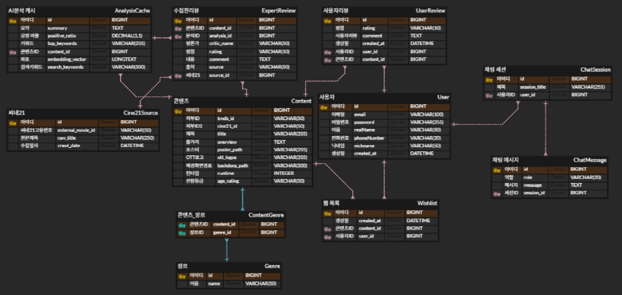
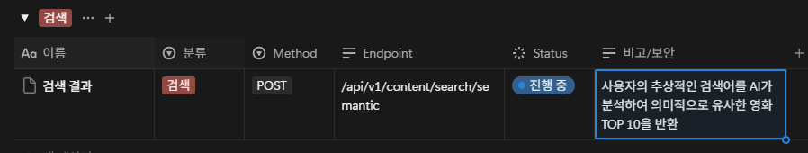

# Connected-M 검색 엔진 
- 시맨틱 검색 엔진 설계

## 필요성
- 단순히 제목이나 장르로 필터링하는 기능은 기존 서비스와 차별점이 없음
- 사용자가 키워드 및 추상적인 문장을 검색해도 AI가 그 의미를 파악하여 최적의 영화를 제안해야함 (최초 기획 및 설계 목표)

## 접근 방식(3단계)
1. 키워드 가중치 검색 (Short-term)
    - AI분석 데이터의 summary와 top_keywords를 활용해서 검색 정확도 향상
2. 문장 의미 기반 검색(Vector Search)
    - 텍스트를 숫자의 나열(Vector)로 변환하여 `의미적 유사도`를 계산.(파이썬 라이브러리 활용 예정)
3. 자바-파이썬 하이브리드 구조
    - 자바(Spring Boot) : 검색 요청 처리 및 결과 서빙(메인 컨트롤 타워).
    - 파이썬(AI/Data) : 줄거리 및 리뷰 데이터를 벡터값으로 변환하여 DB에 공급

## ERD확장 계획
- AnalysisCache 테이블 수정 
    - embedding_vector(TEXT) : 의미 기반 검색을 위한 벡터 데이터 저장용.
    - search_keywords(VARCHAR) : 검색 성능 향상을 위한 AI태그 집합.
- 기존 API나 크롤링 로직은 그대로 유지하되, 데이터가 DB에 쌓일 때 위 필드만 추가로 채워줌

## 향후 과제
- Java에서 벡터 유사도 계산 라이브러리 검토(Spring Data JPA 연동).
- AI 분석 데이터를 인덱싱하기 위한 정규화 작업 

## 시맨틱 검색 엔진 기술 스택

### 데이터 치리 및 벡터화(AI 파트)
- python
- 라이브러리 : Sentence-Transformers
    - 영화 줄거리와 리뷰를 AI가 이해할 수 있는 `의미 숫자(벡터)`로 변환
- 모델 : 한국어 문장 유사도 분석 최적화 모델(오픈 소스)

### 백엔드 및 검색 로직(Java 파트)
- Java
- Spiring boot
- ORM : Spring Data JPA
- 검색 로직 : 코사인 유사도(Cosine Similarity) 연산
    - 사용자의 검색 문장과 영화 데이터 사이의 _의미적 거리_ 를 계산하여 가장 가까운 영화를 추천

### 데이터 저장소(DB)
- MariaDB
- AI분석 결과 및 벡터 데이터를 기존 테이블과 1:1 매칭하여 저장합니다.


# ERD 설계 변경

## AnalysisCache 테이블 수정

embedding_vector,LONGTEXT,NULL 허용,[NEW] 문장 의미 데이터 (AI가 생성한 숫자 뭉치)
search_keywords,VARCHAR(500),NULL 허용,[NEW] 검색 가중치용 태그 (AI 키워드 + 분위기 태그)



```erDiagram
    CONTENT ||--o{ ANALYSISCACHE : "1:1 분석"
    ANALYSISCACHE {
        bigint id PK
        text summary "줄거리 요약"
        decimal positive_ratio "긍정 비율"
        varchar top_keywords "핵심 키워드"
        varchar search_keywords "검색 최적화 태그 (추가)"
        longtext embedding_vector "벡터 데이터 (추가)"
        bigint content_id FK
    }
    CONTENT {
        bigint id PK
        varchar title "제목"
        text overview "원문 줄거리"
    }
```

# embedding_vector 수집 및 저장 로직(python)

1. 파이썬 '벡터 추출기' 준비(The Converter)
2. 자바 - 파이썬 통신 채널 개설
3. 검색 유틸리티 클래스 작성(Java)

## expert_saver.py 수정
```python
def _init_db(self):
        """[자가 치유] 테이블 생성 및 컬럼 자동 추가"""
        conn = self._get_connection()
        try:
            with conn.cursor() as cur:
                # 1. content 테이블 cine21_id 체크
                try:
                    cur.execute("SELECT cine21_id FROM content LIMIT 1")
                except pymysql.err.InternalError as e:
                    if e.args[0] == 1054:
                        print("ℹ️ 'content' 테이블에 'cine21_id' 컬럼이 없어 추가합니다...")
                        cur.execute("ALTER TABLE content ADD COLUMN cine21_id VARCHAR(50) UNIQUE")
                        conn.commit()
                
                # 2. analysis_cache 필수 데이터 확인
                cur.execute('''
                    INSERT IGNORE INTO `analysis_cache` (id, summary, positive_ratio) 
                    VALUES (1, '데이터 수집을 위한 임시 분석 객체', 0.0);
                ''')

                # --- [추가된 구간] 의미 좌표(벡터) 및 키워드 컬럼 자동 추가 ㅋㅋㅋㅋ ---
                cur.execute("SHOW COLUMNS FROM analysis_cache LIKE 'embedding_vector'")
                if not cur.fetchone():
                    print("ℹ️ 'analysis_cache' 테이블에 '의미 좌표' 컬럼이 없어 추가합니다... ㅋㅋㅋㅋ")
                    cur.execute("ALTER TABLE analysis_cache ADD COLUMN embedding_vector LONGTEXT")
                    cur.execute("ALTER TABLE analysis_cache ADD COLUMN search_keywords VARCHAR(500)")
                    conn.commit()
                # ------------------------------------------------------------------

                # 3. expert_review 테이블 생성
                cur.execute('''
                    CREATE TABLE IF NOT EXISTS `expert_review` (
                        `id` BIGINT NOT NULL AUTO_INCREMENT PRIMARY KEY,
                        `content_id` BIGINT NOT NULL,
                        `analysis_id` BIGINT NOT NULL,
                        `movie_title` VARCHAR(255) NOT NULL,
                        `critic_name` VARCHAR(100) NOT NULL,
                        `rating` VARCHAR(10) NOT NULL,
                        `comment` TEXT NOT NULL,
                        `source` VARCHAR(50) DEFAULT 'Cine21',
                        `created_at` TIMESTAMP DEFAULT CURRENT_TIMESTAMP,
                        INDEX idx_content_id (content_id)
                    ) ENGINE=InnoDB DEFAULT CHARSET=utf8mb4;
                ''')
            conn.commit()
            print(f"✅ DB 초기화 및 '의미 좌표' 컬럼 체크 완료 (포트: {self.config['port']})")
        except Exception as e:
            print(f"⚠️ 초기화 중 알림: {e}")
        finally:
            conn.close()
```
## embedding_engine.py 신규 생성(embedding vector coverter)
```python
from sentence_transformers import SentenceTransformer

class MeaningVectorEngine:
    def __init__(self):
        # 한국어 성능 끝판왕
        self.model = SentenceTransformer('jhgan/ko-sroberta-multitask')
    
    def generate_vector(self, text):
        if not text: return None
        # 문장을 숫자의 나열(의미 좌표)로 변환
        vector = self.model.encode(text)
        return str(vector.tolist()) # DB 저장을 위해 문자열로 변환
```

## main.py 연결
```python
# 주석 부분 수정
for genre, movies in movie_data.MOVIE_CATEGORIES.items():
        print(f"\n --- {genre} ---")

        for movie_name, cine21_id in movies.items():
            print(f"'{movie_name}' 수집중... ID: {cine21_id} ")

            try:
                result = scraper.get_expert_reviews(cine21_id, limit=10)

                if result:

                    # 1. 텍스트 합치기: 수집된 리뷰 10개를 하나의 덩어리로
                    all_reviews_text = " ".join([r['content'] for r in result])

                    # 2. 의미 좌표 생성 : AI가 이 영화의 '느낌'을 숫자로 변환
                    print(f"🧠 '{movie_name}'의 의미 좌표를 추출하는 중... (잠시만 기다려주세요!)")
                    meaning_vector = engine.generate_vector(all_reviews_text)

                    db.save_review(
                        cine21_id=cine21_id,
                        analysis_id=DEFAULT_ANALYSIS_ID,
                        movie_title=movie_name,
                        reviews=result,
                        vector=meaning_vector # 파라미터 추가
                    )
                    print(f"저장 완료 (cine21_id : {cine21_id}, 제목 : {movie_name})")
                else:
                    print("수집 된 리뷰가 없습니다.")

            except Exception as e:
                print(f"오류 발생: {e}")

    scraper.close()

```

## expert_saver.py 추가
```python
def save_review(self, cine21_id, analysis_id, movie_title, reviews, vector=None):
        """리뷰 저장 (부모 데이터 자동 생성 포함)"""
        if not reviews:
            return

        conn = self._get_connection()
        try:
            with conn.cursor() as cur:
                # --- [방어 1] analysis_cache 1번 데이터 확인 및 재생성 ---
                cur.execute("SELECT id FROM analysis_cache WHERE id = %s", (analysis_id,))
                if not cur.fetchone():
                    cur.execute(
                        "INSERT INTO analysis_cache (id, summary, positive_ratio) VALUES (%s, %s, %s)",
                        (analysis_id, '임시 분석 데이터', 0.0)
                    )

                if vector:
                    cur.execute(
                        "UPDATE analysis_cache SET embedding_vector = %s WHERE id = %s",
                        (vector, analysis_id)
                    )
                    
                # --- [방어 2] content 테이블 영화 정보 확인 및 재생성 (cine21_id 기준) ---
                cur.execute("SELECT id FROM content WHERE cine21_id = %s", (cine21_id,))
                row = cur.fetchone()
                
                if row:
                    content_id = row['id']
                else:
                    # 영화 정보가 없으면 새로 생성 (cine21_id 포함)
                    # tmdb_id는 현재 크롤러 구조상 cine21_id와 동일하게 임시로 저장하거나 NULL 가능하게 처리
                    cur.execute(
                        "INSERT INTO content (title, tmdb_id, cine21_id) VALUES (%s, %s, %s)",
                        (movie_title, cine21_id, cine21_id)
                    )
                    content_id = cur.lastrowid
                    print(f"ℹ️ content 테이블에 '{movie_title}' 정보를 자동 생성했습니다. (ID: {content_id})")

                # --- [방어 3] 리뷰 일괄 저장 ---
                sql = """
                      INSERT INTO expert_review (content_id, analysis_id, movie_title, critic_name, rating, comment, source) \
                      VALUES (%s, %s, %s, %s, %s, %s, %s) \
                      """

                data_insert = []
                for r in reviews:
                    row_data = (
                        content_id,   
                        analysis_id,  
                        movie_title,  
                        r['critic'],  
                        str(r['score']),  # 문자열 그대로 저장 (float 형변환 제거)
                        r['content'],  
                        'Cine21'  
                    )
                    data_insert.append(row_data)

                cur.executemany(sql, data_insert)

            conn.commit()
            print(f"✨ '{movie_title}' 리뷰 {len(reviews)}건 저장 성공!")

        except Exception as e:
            print(f"❌ 저장 에러 발생: {e}")
            conn.rollback()
        finally:
            conn.close()
```
- 방어1과 방어2로직 사이 아래 로직 추가
```python
if vector:
    cur.execute(
        "UPDATE analysis_cache SET embedding_vector = %s WHERE id = %s",
        (vector, analysis_id)
    )
```

# 검색 유사도 엔진 설계(Java Spring Boot)

## 패키지
- content.dto : `ContentSearchRequest.java`,`ContentSearchResponse.java`
- content.service : `SemanticSearchService.java`
- global.utils : `VectorUtils.java`

## DTO

### ContentSearchRequest.java
```java
package com.Connectedm.backend.domain.content.dto;

import lombok.Getter;
import lombok.Setter;

@Getter
@Setter
public class ContentSearchRequest {
    private String query;

    private double[] queryVector;
}

```

### ContentSearchResponse.java
```java
package com.Connectedm.backend.domain.content.dto;

import lombok.Builder;
import lombok.Getter;

@Getter@Builder
public class ContentSearchResponse {
    private Long contentId;
    private String title;
    private String posterPath;
    private double similaritySource;
}

```

## Utils 
```java
package com.Connectedm.backend.global.Utils;

import java.util.Arrays;

public class VectorUtils {
    /**
     * [코사인 유사도 엔진]
     * 두 벡터 사이의 각도를 계산하여 유사도를 측정합니다. 
     * 결과값: 1.0에 가까울수록 "이건 거의 똑같은 영화다!"
     */
    public static double cosineSimilarity(double[] vectorA, double[] vectorB) {
        if (vectorA == null || vectorB == null || vectorA.length != vectorB.length) {
            return 0.0;
        }

        double dotProduct = 0.0;
        double normA = 0.0;
        double normB = 0.0;

        for (int i = 0; i < vectorA.length; i++) {
            dotProduct += vectorA[i] * vectorB[i];
            normA += Math.pow(vectorA[i], 2);
            normB += Math.pow(vectorB[i], 2);
        }

        return dotProduct / (Math.sqrt(normA) * Math.sqrt(normB));
    }

    /**
     * [데이터 변환기]
     * DB의 LONGTEXT 문자열을 자바가 계산할 수 있는 숫자 배열로 바꿉니다
     */
    public static double[] parseVectorString(String vectorStr) {
        if (vectorStr == null || vectorStr.isEmpty()) return new double[0];

        // 대괄호 [ ] 제거하고 쉼표로 분리 ㅋㅋㅋㅋ
        String cleanStr = vectorStr.replace("[", "").replace("]", "");
        return Arrays.stream(cleanStr.split(","))
                .mapToDouble(Double::parseDouble)
                .toArray();
    }
}

```

## Service 작성
```java
package com.Connectedm.backend.domain.content.service;

import com.Connectedm.backend.domain.content.dto.ContentSearchRequest;
import com.Connectedm.backend.domain.content.dto.ContentSearchResponse;
import com.Connectedm.backend.domain.content.repository.AnalysisCacheRepository;
import com.Connectedm.backend.global.Utils.VectorUtils;
import lombok.RequiredArgsConstructor;
import org.springframework.stereotype.Service;
import org.springframework.transaction.annotation.Transactional;

import java.util.List;
import java.util.stream.Collectors;

@Service
@RequiredArgsConstructor
@Transactional(readOnly = true)
public class SemanticSearchService {
    private final AnalysisCacheRepository analysisCacheRepository;

    public List<ContentSearchResponse> searchBySemantic(ContentSearchRequest request) {
        // 1. 사용자의 검색어 벡터(queryVector)를 가져온다.
        double[] queryVector = request.getQueryVector();

        if (queryVector == null || queryVector.length == 0) {
            throw  new IllegalArgumentException("검색어의 좌표가 생성되지 않았습니다.");
        }
        // 2. DB의 모든 분석 데이터를 가져와서 유사도 계산 루프
        return analysisCacheRepository.findAll().stream()
                .filter(cache -> cache.getEmbeddingVector() != null) //벡터가 없는 데이터는 패스
                .map(cache -> {
                    // 3. DB문자열 -> 숫자 배열 변환(VectorUtils 활용)
                    double[] targetVector = VectorUtils.parseVectorString(cache.getEmbeddingVector());

                    // 4. 코사인 유사도 연산
                    double score = VectorUtils.cosineSimilarity(queryVector, targetVector);

                    // 5. Response DTO 빌드(1:1매핑 덕분에 연관 객체 접근 가능)
                    return ContentSearchResponse.builder()
                            .contentId(cache.getId())
                            .title(cache.getContent().getTitle())
                            .posterPath(cache.getContent().getPosterPath())
                            .similaritySource(score)
                            .build();
                })
                // 6. 유사도 높은 순(내림차순) 정렬
                .sorted((a, b) -> Double.compare(b.getSimilaritySource(), a.getSimilaritySource()))
                .limit(10) // TOP10만 추출
                .collect(Collectors.toList());
    }
}

```

## Controller

- Request Body
```json
{
  "query": "String (사용자 입력 문장)"
}
```
- Rsponse body
```json
[
  {
    "contentId": "Long (영화 식별자)",
    "title": "String (영화 제목)",
    "posterPath": "String (포스터 경로)",
    "similaritySource": "Double (코사인 유사도 점수: 0.0 ~ 1.0)"
  }
]
```

- Vectorizing : 자바가 파이썬에게 API 호출
- Similarity(검색 엔진) : 파이썬에서 받아온 벡터를 들고, SemanticSearchService 호출
- Response(결과) : 계산된 점수와 영화 리스트를 프론트엔드에 응답

### python -> vector_server.py 작성
- 자바의 요청을 기다리는 서버(파이썬)
```python
from flask import Flask, request, jsonify
from embedding_engine import MeaningVectorEngine

app = Flask(__name__)
engine = MeaningVectorEngine()

@app.route('/vecotorize', methods=['POST'])
def vectorize():
    data = request.json
    text = data.get('text', '')

    if not text:
        return jsonify({"error" : "텍스트가 없습니다."}), 400
    
    vector = engine.model.encode(text),tolist()
    return jsonify(vector)

if __name__ == '__main__':
    app.run(host='0.0.0.0', port=5000)
```
- 자바에서 파이썬의 응답을 기다리는 config 클래스
```java
package com.Connectedm.backend.config;

import org.springframework.context.annotation.Bean;
import org.springframework.context.annotation.Configuration;
import org.springframework.web.client.RestTemplate;

@Configuration
public class RestTemplateConfig {

    @Bean
    public RestTemplate restTemplate() {
        return new RestTemplate();
    }
}

```
