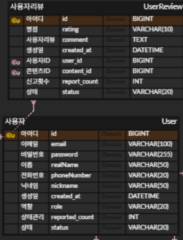

# 관리자 페이지 준비(벡엔드)

- 사용자의 리뷰 관리(블라인드 및 삭제 처리)
- 규칙 상습 위반 사용자 관리(ACTIVE, BANNED, PENDING)

## Enum 클래스 생성
- 타입 안정성(Type Safety) : 오타 실수 제거
- 의미의 명황석(Self-Documenting) : 관리의 용이
- 데이터 무결성(Data Integrity) : DB에 저장될 때도 미리 약속된 값만 들어감
```java
package com.Connectedm.backend.domain.user.entity;
```
이상의 위치에 enum클래스 생성
이하는 enum 클래스 코드
```java
package com.Connectedm.backend.domain.user.entity;

import lombok.Getter;
import lombok.RequiredArgsConstructor;

@Getter
@RequiredArgsConstructor
public enum UserRole {

    // 스프링 시큐리티의 기본 관례인 "ROLE_" 접두사 포함
    ROLE_USER("일반 사용자"),
    ROLE_ADMIN("관리자");

    private final String description;   // 로그나 UI 출력용 설명

}

```

## User 엔티티 수정

- User 엔티티 ROLE 컬럼 추가
```java
// role 컬럼 추가
    @Enumerated(EnumType.STRING)
    @Column(nullable = false)
    private UserRole role = UserRole.ROLE_USER; // 기본값은 일반 사용자
```

## Spring Security
- global.security 패키지 생성 : CustomUserDetails 클래스 생성
```java
package com.Connectedm.backend.global.security;

import com.Connectedm.backend.domain.user.entity.User;
import org.springframework.security.core.GrantedAuthority;
import org.springframework.security.core.authority.SimpleGrantedAuthority;
import org.springframework.security.core.userdetails.UserDetails;

import java.util.Collection;
import java.util.Collections;


public class CustomUserDetails implements UserDetails {

    private final User user;

    public CustomUserDetails(User user) {
        this.user = user;
    }

    @Override
    public Collection<? extends GrantedAuthority> getAuthorities() {
        return Collections.singletonList(new SimpleGrantedAuthority(user.getRole().name()));
    }

    @Override
    public String getPassword() {
        return user.getPassword();
    }

    @Override
    public String getUsername() {
        return user.getEmail();
    }

    @Override
    public boolean isAccountNonExpired() {
        return true;
    }

    @Override
    public boolean isAccountNonLocked() {
        return true;
    }

    @Override
    public boolean isCredentialsNonExpired() {
        return true;
    }

    @Override
    public boolean isEnabled() {
        return true;
    }
}

```

## UserDetails 서비스
- CustomUserDetails 클래스와 같은 패키지에 클래스 생성
```java
package com.Connectedm.backend.global.security;

import com.Connectedm.backend.domain.user.entity.User;
import com.Connectedm.backend.domain.user.repository.UserRepository;
import lombok.RequiredArgsConstructor;
import org.springframework.security.core.userdetails.UserDetails;
import org.springframework.security.core.userdetails.UserDetailsService;
import org.springframework.security.core.userdetails.UsernameNotFoundException;
import org.springframework.stereotype.Service;

@Service
@RequiredArgsConstructor
public class CustomUserDetailsService implements UserDetailsService {

    private final UserRepository userRepository;

    @Override
    public UserDetails loadUserByUsername(String email) throws UsernameNotFoundException {
        // 1. DB에서 이메일로 유저 찾기
        User user = userRepository.findByEmail(email)
                .orElseThrow(() -> new UsernameNotFoundException("해당 이메일의 유저를 찾을 수 없습니다 : " + email));

        // 2. 찾은 User 엔티티를 CustomUserDetails에 담아서 리턴
        return new CustomUserDetails(user);
    }
}

```

## 관리자 페이지 서비스(1) : 도메인 서비스 계층

### API 명세 

1. 유저 리뷰 API명세 추가 
    - /api/contents/reviews/{id}/report
    - 메소드 : POST
    - 특정 리뷰 신고

2. 관리자페이지 주요 API 명세
    1. 신고된 리뷰 목록 조회
    - /api/admin/reviews/reported
    - 메소드 : GET
    2. 리뷰 상태 변경
    - /api/admin/reviews/{id}/status
    - 메소드 : PATCH
    3. 리뷰 삭제
    - /api/admin/reviews/{id}
    - 메소드 : DELETE
    4. 상습신고 유저 조회
    - /api/admin/users/reported
    - 메소드 : GET
    5. 유저 상태 변경
    - /api/admin/users/{id}/status
    - 메소드 : PATCH

### User, Review 엔티티 추가 수정



```java
// 유저 엔티티 추가

    @Column(nullable = false)
    private int reportedCount = 0;

    @Enumerated(EnumType.STRING)
    @Column(nullable = false)
    private UserStatus status = UserStatus.ACTIVE;

    // setter 추가
    public void increaseReportedCount() {
        this.reportedCount++;
    }

// 유저 리뷰 엔티티 추가

    @Column(nullable = false)
    private int reportCount = 0;

    
    @Enumerated(EnumType.STRING)
    @Column(nullable = false)
    private ReviewStatus status = ReviewStatus.NORMAL;

    // 마찬가지로 setter 추가
    public void increaseReportCount() {
        this.reportCount++;
    }
```
- 각 entity 패키지 내에 enum 클래스 생성
```java
// UserStatus
package com.Connectedm.backend.domain.user.entity;

import lombok.Getter;
import lombok.RequiredArgsConstructor;

@Getter
@RequiredArgsConstructor
public enum UserStatus {
    ACTIVE("활동 중"),
    PENDING("활동 제한/경고"),
    BANNED("영구 정지");

    private final String description;
}


// ReviewStatus
package com.Connectedm.backend.domain.content.entity;

import lombok.Getter;
import lombok.RequiredArgsConstructor;

@Getter
@RequiredArgsConstructor
public enum ReviewStatus {
    NORMAL("정상 노출"),
    HIDDEN("관리자 블라인드");

    private final String description;
}

```

### UserSerivce, ReviewService 로직 추가

```java
// UserService
/**
     *  [관리자용] 유저 상태 변경(BANNED, PENDING)
     */
    @Transactional
    public void updateUserStatus(Long userId, UserStatus status) {
        User user = userRepository.findById(userId)
                .orElseThrow(() -> new EntityNotFoundException("찾을 수 없는 사용자입니다."));

        // 엔티티에 만든 전용 Setter 이용
        user.setStatus(status);
```

```java
// ReivewSerivce
    @Transactional
    public void reportReview(Long reviewId) {
        // 1. 해당 리뷰 소환
        UserReview userReview = userReviewRepository.findById(reviewId)
                .orElseThrow(() -> new EntityNotFoundException("리뷰가 없습니다."));

        // 2. 리뷰 신고 카운트
        userReview.increaseReportCount();

        // 3. 리뷰 작성자의 누적 신고 카운트
        User writer = userReview.getUser();
        if (writer != null) {
            writer.increaseReportedCount();
        }
    }
```

### CustomUserDetailsService 클래스 로직 수정 

```java
package com.Connectedm.backend.global.security;

import com.Connectedm.backend.domain.user.entity.User;
import com.Connectedm.backend.domain.user.entity.UserStatus;
import com.Connectedm.backend.domain.user.repository.UserRepository;
import lombok.RequiredArgsConstructor;
import org.springframework.security.authentication.DisabledException;
import org.springframework.security.core.userdetails.UserDetails;
import org.springframework.security.core.userdetails.UserDetailsService;
import org.springframework.security.core.userdetails.UsernameNotFoundException;
import org.springframework.stereotype.Service;

@Service
@RequiredArgsConstructor
public class CustomUserDetailsService implements UserDetailsService {

    private final UserRepository userRepository;

    @Override
    public UserDetails loadUserByUsername(String email) throws UsernameNotFoundException {
        // 1. DB에서 이메일로 유저 찾기
        User user = userRepository.findByEmail(email)
                .orElseThrow(() -> new UsernameNotFoundException("해당 이메일의 유저를 찾을 수 없습니다 : " + email));

        // 정지된 유저 로그인 금지
        if (user.getStatus() == UserStatus.BANNED) {
            throw new DisabledException("정지된 계정입니다.");
        }
        // 2. 찾은 User 엔티티를 CustomUserDetails에 담아서 리턴
        return new CustomUserDetails(user);
    }
}

```
기존 로직에서 아래의
```java
// 정지된 유저 로그인 금지
        if (user.getStatus() == UserStatus.BANNED) {
            throw new DisabledException("정지된 계정입니다.");
        }
```
로직 추가

### 사용자 리뷰 신고하기 Controller, DTO
1. Controller
```java
//UserReviewController 추가
/**
     * [POST] 특정 리뷰 신고
     */
    @PostMapping("/contents/reviews/{id}/report")
    public ResponseEntity<Void> reportReview(@PathVariable Long id,
                                             @RequestBody(required = false)ReviewReportRequestDto requestDto) {
        reviewService.reportReview(id);
        return ResponseEntity.ok().build();
    }
```
2. DTO : DTO가 없어도 ID값을 URL 경로로 받기 때문에 별도의 JSON바디(RequestBody)가 필요 없어 간결하고 빠르지만. 신고 사유등의 확장성과 데이터 캡슐화를 위해 작성
```java

``` 

## 관리자 페이지 서비스(2) : admin 패키지  

### admin 패키지 생성
```
com.Connectedm.backend.domain.admin
├── controller
│   └── AdminController.java
├── service
│   └── AdminService.java 
└── dto
    ├── AdminUserResponseDto.java
    └── AdminReviewResponseDto.java 
```

### DTO
```java
//AdminReviewResponseDto
package com.Connectedm.backend.domain.admin.dto;

import com.Connectedm.backend.domain.content.entity.ReviewStatus;
import lombok.Builder;
import lombok.Getter;

@Getter
@Builder
public class AdminReviewResponseDto {
    private Long reviewId;
    private String writeNickname;
    private String movieTitle;
    private String comment;
    private int reportCount;
    private ReviewStatus status; // 현재 노출 상태
}
```
```java
//AdminUserResponseDto
package com.Connectedm.backend.domain.admin.dto;

import com.Connectedm.backend.domain.user.entity.UserStatus;
import lombok.Builder;
import lombok.Getter;

@Getter
@Builder
public class AdminUserResponseDto {
    private Long userId;
    private String email;
    private String nickname;
    private int reportedCount;
    private UserStatus status;
}
```
### Service 로직
```java
package com.Connectedm.backend.domain.admin.service;

import com.Connectedm.backend.domain.admin.dto.AdminReviewResponseDto;
import com.Connectedm.backend.domain.admin.dto.AdminUserResponseDto;
import com.Connectedm.backend.domain.content.entity.ReviewStatus;
import com.Connectedm.backend.domain.content.entity.UserReview;
import com.Connectedm.backend.domain.content.repository.UserReviewRepository;
import com.Connectedm.backend.domain.content.service.ReviewService;
import com.Connectedm.backend.domain.user.entity.UserStatus;
import com.Connectedm.backend.domain.user.repository.UserRepository;
import com.Connectedm.backend.domain.user.service.UserService;
import jakarta.persistence.EntityNotFoundException;
import lombok.RequiredArgsConstructor;
import org.springframework.stereotype.Service;
import org.springframework.transaction.annotation.Transactional;

import java.util.List;
import java.util.stream.Collectors;

@Service
@Transactional(readOnly = true)
@RequiredArgsConstructor
public class AdminService {

    private final UserReviewRepository userReviewRepository;
    private final UserRepository userRepository;
    private final ReviewService reviewService;
    private final UserService userService;

    // ==========================================================
    // 1. [조회] 명세 대응
    // ==========================================================

    /**
     * [조회] 신고된 리뷰 목록(신고 많은 순)
     */
    public List<AdminReviewResponseDto> getReportedReview() {
        return userReviewRepository.findAllByReportCountGreaterThanOrderByReportCountDesc(0)
                .stream()
                .map(review -> AdminReviewResponseDto.builder()
                        .reviewId(review.getId())
                        .writeNickname(review.getUser().getNickname())
                        .movieTitle(review.getContent().getTitle())
                        .comment(review.getComment())
                        .reportCount(review.getReportCount())
                        .status(review.getStatus())
                        .build())
                .collect(Collectors.toList());
    }

    /**
     * [조회] 상습 신고 유저 목록(신고 많은 순)
     */
    public List<AdminUserResponseDto> getReportedUsers() {
        return userRepository.findAllByReportedCountGreaterThanOrderByReportedCountDesc(0)
                .stream()
                .map(user -> AdminUserResponseDto.builder()
                        .userId(user.getId())
                        .email(user.getEmail())
                        .nickname(user.getNickname())
                        .reportedCount(user.getReportedCount())
                        .status(user.getStatus())
                        .build())
                .collect(Collectors.toList());
    }
    // ==========================================================
    // 2. [변경/처분]
    // ==========================================================

    /**
     * [PATCH] 리뷰 상태 변경 (NORMAL <-> HIDDEN)
     */
    @Transactional
    public void updateReviewStatus(Long reviewId, ReviewStatus status) {
        UserReview review = userReviewRepository.findById(reviewId)
                .orElseThrow(() -> new EntityNotFoundException("리뷰 없음"));
        review.changeStatusByAdmin(status);
    }

    /**
     * [DELETE] 리뷰 삭제
     */
    @Transactional
    public void deleteReview(Long reviewId) {
        reviewService.deleteUserReview(0L, "ROLE_ADMIN", reviewId);
    }

    /**
     * [PATCH] 유저 상태 변경(ACTIVE, PENDING, BANNED)
     */
    @Transactional
    public void updateUserStatus(Long userId, UserStatus status) {
        userService.updateUserStatus(userId,status);
    }

}

```

### Controller 작성
```java
package com.Connectedm.backend.domain.admin.controller;

import com.Connectedm.backend.domain.admin.dto.AdminReviewResponseDto;
import com.Connectedm.backend.domain.admin.dto.AdminUserResponseDto;
import com.Connectedm.backend.domain.admin.service.AdminService;
import com.Connectedm.backend.domain.content.entity.ReviewStatus;
import com.Connectedm.backend.domain.user.entity.UserStatus;

import lombok.RequiredArgsConstructor;
import org.springframework.http.ResponseEntity;
import org.springframework.web.bind.annotation.*;

import java.util.List;

@RestController
@RequestMapping("api/admin")
@RequiredArgsConstructor
public class AdminController {
    private final AdminService adminService;

    // [GET] 신고된 리뷰 목록 조회
    @GetMapping("/reviews/reported")
    public ResponseEntity<List<AdminReviewResponseDto>> getReportedReviews() {
        return ResponseEntity.ok(adminService.getReportedReviews());
    }

    // [PATCH] 리뷰 상태 변경
    @PatchMapping("/review/{id}/status")
    public ResponseEntity<Void> updateReviewStatus(
            @PathVariable(value = "id") Long id,
            @RequestParam(value = "status") ReviewStatus status) {
        adminService.updateReviewStatus(id, status);;
        return ResponseEntity.ok().build();
    }

    // [DELETE] 리뷰 삭제
    @DeleteMapping("/reviews/{id}")
    public ResponseEntity<Void> deleteReview(@PathVariable Long id) {
        adminService.deleteReview(id);
        return ResponseEntity.ok().build();
    }

    // [GET] 상습 신고 유저 조회
    @GetMapping("/users/{id}/status")
    public ResponseEntity<List<AdminUserResponseDto>> getReportedUsers() {
        return ResponseEntity.ok(adminService.getReportedUsers());
    }

    // [PATCH] 유저 상태 변경
    @PatchMapping("/users/{id}/status")
    public ResponseEntity<Void> updateUsersStatus(
            @PathVariable Long id,
            @RequestParam UserStatus status) {
        adminService.updateUserStatus(id, status);
        return ResponseEntity.ok().build();
    }
}

```

### SecurityConfig 추가
```java
.requestMatchers("/api/admin/**").hasRole("ADMIN") 
```
위 로직 추가