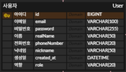

# 관리자 페이지 준비(벡엔드)

## Enum 클래스 생성
- 타입 안정성(Type Safety) : 오타 실수 제거
- 의미의 명황석(Self-Documenting) : 관리의 용이
- 데이터 무결성(Data Integrity) : DB에 저장될 때도 미리 약속된 값만 들어감
```java
package com.Connectedm.backend.domain.user.entity;
```
이상의 위치에 enum클래스 생성
이하는 enum 클래스 코드
```java
package com.Connectedm.backend.domain.user.entity;

import lombok.Getter;
import lombok.RequiredArgsConstructor;

@Getter
@RequiredArgsConstructor
public enum UserRole {

    // 스프링 시큐리티의 기본 관례인 "ROLE_" 접두사 포함
    ROLE_USER("일반 사용자"),
    ROLE_ADMIN("관리자");

    private final String description;   // 로그나 UI 출력용 설명

}

```

## User 엔티티 수정

- User 엔티티 ROLE 컬럼 추가
```java
// role 컬럼 추가
    @Enumerated(EnumType.STRING)
    @Column(nullable = false)
    private UserRole role = UserRole.ROLE_USER; // 기본값은 일반 사용자
```

## Spring Security
- global.security 패키지 생성 : CustomUserDetails 클래스 생성
```java
package com.Connectedm.backend.global.security;

import com.Connectedm.backend.domain.user.entity.User;
import org.springframework.security.core.GrantedAuthority;
import org.springframework.security.core.authority.SimpleGrantedAuthority;
import org.springframework.security.core.userdetails.UserDetails;

import java.util.Collection;
import java.util.Collections;


public class CustomUserDetails implements UserDetails {

    private final User user;

    public CustomUserDetails(User user) {
        this.user = user;
    }

    @Override
    public Collection<? extends GrantedAuthority> getAuthorities() {
        return Collections.singletonList(new SimpleGrantedAuthority(user.getRole().name()));
    }

    @Override
    public String getPassword() {
        return user.getPassword();
    }

    @Override
    public String getUsername() {
        return user.getEmail();
    }

    @Override
    public boolean isAccountNonExpired() {
        return true;
    }

    @Override
    public boolean isAccountNonLocked() {
        return true;
    }

    @Override
    public boolean isCredentialsNonExpired() {
        return true;
    }

    @Override
    public boolean isEnabled() {
        return true;
    }
}

```

## UserDetails 서비스
- CustomUserDetails 클래스와 같은 패키지에 클래스 생성
```java
package com.Connectedm.backend.global.security;

import com.Connectedm.backend.domain.user.entity.User;
import com.Connectedm.backend.domain.user.repository.UserRepository;
import lombok.RequiredArgsConstructor;
import org.springframework.security.core.userdetails.UserDetails;
import org.springframework.security.core.userdetails.UserDetailsService;
import org.springframework.security.core.userdetails.UsernameNotFoundException;
import org.springframework.stereotype.Service;

@Service
@RequiredArgsConstructor
public class CustomUserDetailsService implements UserDetailsService {

    private final UserRepository userRepository;

    @Override
    public UserDetails loadUserByUsername(String email) throws UsernameNotFoundException {
        // 1. DB에서 이메일로 유저 찾기
        User user = userRepository.findByEmail(email)
                .orElseThrow(() -> new UsernameNotFoundException("해당 이메일의 유저를 찾을 수 없습니다 : " + email));

        // 2. 찾은 User 엔티티를 CustomUserDetails에 담아서 리턴
        return new CustomUserDetails(user);
    }
}

```

## 관리자 전용 컨트롤러