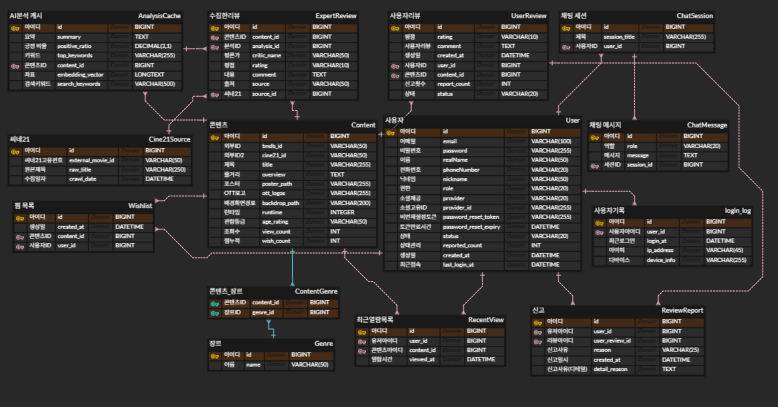

# DB 업데이트
- 신고 기능의 구현과 관리자페이지 신고자의 정보를 알기 위해 review_report 테이블 추가

## ERD
- 쿼리
```sql
-- 1. User 테이블 (모든 유저 관리의 근본)
CREATE TABLE `User` (
    `id`                    BIGINT       NOT NULL AUTO_INCREMENT PRIMARY KEY,
    `email`                 VARCHAR(100) NOT NULL UNIQUE COMMENT '로그인용(중복불가)',
    `password`              VARCHAR(255) NOT NULL COMMENT '암호화된 비밀번호',
    `realName`              VARCHAR(50)  NOT NULL COMMENT '사용자 이름',
    `phoneNumber`           VARCHAR(20)  NOT NULL,
    `nickname`              VARCHAR(50)  NOT NULL COMMENT '서비스용 이름',
    `role`                  VARCHAR(20)  NOT NULL DEFAULT 'ROLE_USER' COMMENT '사용자 권한',
    `provider`              VARCHAR(20)  NOT NULL COMMENT 'Enum(LOCAL, KAKAO, GOOGLE)',
    `provider_id`           VARCHAR(255) NOT NULL,
    `password_reset_token`  VARCHAR(255) NULL UNIQUE,
    `password_reset_expiry` DATETIME     NULL,
    `status`                VARCHAR(20)  NOT NULL DEFAULT 'ACTIVE' COMMENT 'ACTIVE, BANNED, PENDING',
    `reported_count`        INT          NOT NULL DEFAULT 0,
    `created_at`            DATETIME     NULL     DEFAULT now() COMMENT '가입일시',
    `last_login_at`         DATETIME     NULL     DEFAULT now()
);

-- 2. Content 테이블 (작품 데이터 요새)
CREATE TABLE `Content` (
    `id`            BIGINT       NOT NULL AUTO_INCREMENT PRIMARY KEY COMMENT '시스템 관리용 PK',
    `tmdb_id`       VARCHAR(50)  NOT NULL COMMENT 'TMDB API 식별자',
    `cine21_id`     VARCHAR(50)  NULL,
    `title`         VARCHAR(255) NOT NULL COMMENT '작품 제목',
    `overview`      TEXT         NULL COMMENT '줄거리',
    `poster_path`   VARCHAR(255) NULL,
    `ott_logos`     VARCHAR(255) NULL,
    `backdrop_path` VARCHAR(200) NULL,
    `runtime`       INTEGER      NULL,
    `age_rating`    VARCHAR(50)  NULL,
    `view_count`    INT          NULL DEFAULT 0,
    `wish_count`    INT          NULL DEFAULT 0
);

-- 3. UserReview 테이블 (유저들의 지독한 한줄평)
CREATE TABLE `UserReview` (
    `id`           BIGINT      NOT NULL AUTO_INCREMENT PRIMARY KEY COMMENT 'pk',
    `rating`       VARCHAR(10) NOT NULL COMMENT '사용자 평점',
    `comment`      TEXT        NOT NULL COMMENT '사용자 리뷰 본문',
    `created_at`   DATETIME    NOT NULL DEFAULT now() COMMENT '작성일자',
    `user_id`      BIGINT      NOT NULL COMMENT 'fk',
    `content_id`   BIGINT      NOT NULL COMMENT 'fk',
    `report_count` INT         NOT NULL DEFAULT 0,
    `status`       VARCHAR(20) NOT NULL DEFAULT 'NORMAL' COMMENT 'NORMAL, HIDDEN'
);

-- 4. ReviewReport 테이블 (감옥행 급행열차)
CREATE TABLE `ReviewReport` (
    `id`             BIGINT      NOT NULL AUTO_INCREMENT PRIMARY KEY,
    `user_id`        BIGINT      NOT NULL,
    `user_review_id` BIGINT      NOT NULL COMMENT '대상 리뷰 pk',
    `reason`         VARCHAR(25) NULL,
    `created_at`     DATETIME    NULL DEFAULT now(),
    `detail_reason`  TEXT        NULL
);

-- 5. Chat 관련 테이블 (AI 대화 아카이브)
CREATE TABLE `ChatSession` (
    `id`            BIGINT       NOT NULL AUTO_INCREMENT PRIMARY KEY,
    `session_title` VARCHAR(255) NULL COMMENT '세션별 제목',
    `user_id`       BIGINT       NOT NULL
);

CREATE TABLE `ChatMessage` (
    `id`         BIGINT NOT NULL AUTO_INCREMENT PRIMARY KEY,
    `role`       VARCHAR(20) NOT NULL COMMENT 'user/assistant',
    `message`    TEXT   NOT NULL COMMENT '대화 본문',
    `session_id` BIGINT NOT NULL
);

-- 6. 분석 및 통계 테이블
CREATE TABLE `AnalysisCache` (
    `id`               BIGINT       NOT NULL AUTO_INCREMENT PRIMARY KEY,
    `summary`          TEXT         NOT NULL COMMENT 'AI 생성 요약',
    `positive_ratio`   DECIMAL(3,1) NOT NULL COMMENT '긍정 비율',
    `top_keywords`     VARCHAR(255) NULL,
    `content_id`       BIGINT       NOT NULL,
    `embedding_vector` LONGTEXT     NULL COMMENT '임베딩 데이터',
    `search_keywords`  VARCHAR(500) NULL
);

-- 7. 활동 로그 및 기타
CREATE TABLE `Wishlist` (
    `id`         BIGINT   NOT NULL AUTO_INCREMENT PRIMARY KEY,
    `created_at` DATETIME NOT NULL DEFAULT now(),
    `content_id` BIGINT   NOT NULL,
    `user_id`    BIGINT   NOT NULL
);

CREATE TABLE `RecentView` (
    `id`         BIGINT   NOT NULL AUTO_INCREMENT PRIMARY KEY,
    `user_id`    BIGINT   NOT NULL,
    `content_id` BIGINT   NOT NULL,
    `viewed_at`  DATETIME NOT NULL DEFAULT now()
);

CREATE TABLE `login_log` (
    `id`          BIGINT       NOT NULL AUTO_INCREMENT PRIMARY KEY,
    `user_id`     BIGINT       NOT NULL,
    `login_at`    DATETIME     NULL DEFAULT now(),
    `ip_address`  VARCHAR(45)  NULL,
    `device_info` VARCHAR(255) NULL
);

-- 8. 제약 조건 (외래키 연결)
ALTER TABLE `ChatSession` ADD CONSTRAINT `FK_User_ChatSession` FOREIGN KEY (`user_id`) REFERENCES `User` (`id`);
ALTER TABLE `ChatMessage` ADD CONSTRAINT `FK_Session_ChatMessage` FOREIGN KEY (`session_id`) REFERENCES `ChatSession` (`id`);
ALTER TABLE `AnalysisCache` ADD CONSTRAINT `FK_Content_Analysis` FOREIGN KEY (`content_id`) REFERENCES `Content` (`id`);
ALTER TABLE `ReviewReport` ADD CONSTRAINT `FK_User_Report` FOREIGN KEY (`user_id`) REFERENCES `User` (`id`);
ALTER TABLE `ReviewReport` ADD CONSTRAINT `FK_Review_Report` FOREIGN KEY (`user_review_id`) REFERENCES `UserReview` (`id`);
ALTER TABLE `UserReview` ADD CONSTRAINT `FK_User_Review` FOREIGN KEY (`user_id`) REFERENCES `User` (`id`);
ALTER TABLE `UserReview` ADD CONSTRAINT `FK_Content_Review` FOREIGN KEY (`content_id`) REFERENCES `Content` (`id`);
```
